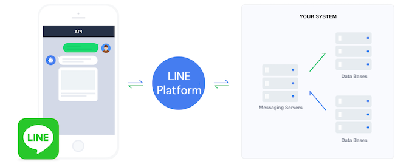

# LINE-Bot-PythonDev

## What is LINE Messaging API


[Messaging API overview](https://developers.line.biz/en/docs/messaging-api/overview/#page-title) - Requests are sent over **HTTPS** in **JSON**. The communication flow between a bot server and the LINE Platform is as follows:

1. A user sends a message to a LINE Official Account.
2. The LINE Platform sends a webhook event to the webhook URL of the bot server.
3. The bot server checks the webhook event and responds to the user through the LINE Platform. *(with your coding/logic)*

\
**What's LINE Messaging API can do?**
1. Send reply messages
2. Send messages at any time
3. **Send different message types**
    1. Text message
    2. Sticker message
    3. Image message
    4. Video message
    5. Audio message
    6. Location message
    7. Imagemap message
    8. Template message
    9. Flex Message
4. Get content sent by users
5. Get user profiles
6. Join group chats
7. Use rich menus
8. Use beacons
9. Use account link
10. Get the number of sent messages


## Create Virtual Environment
Run following command in your working directory
```
virtualenv venv
```
where, `venv` is your virtual environment name

## Activate Virtual Environment
Run following command in your working directory
```
source venv/bin/activate
```

## Install Python Package
There's 3 required packages:
1. line-bot-sdk
2. fastapi
3. uvicorn
4. python-dotenv

To install latest version, run `pip` command to install 
```
pip install line-bot-sdk fastapi uvicorn python-dotenv
```
Or, you can install with the `requirements.txt`
```
pip install -r requirements.txt
```

## Environment Configuration
Create file `.env` and put your token inside.

```
ACCESS_TOKEN=<Your dhannel access token>
CHANNEL_SECRET=<Your Channel secret>
```

## Running FastAPI
Using following command to run FastAPI on port 8000:
```
uvicorn main:app --port 8000 --reload
```
The `reload` flag is for reload everytime that file made change.