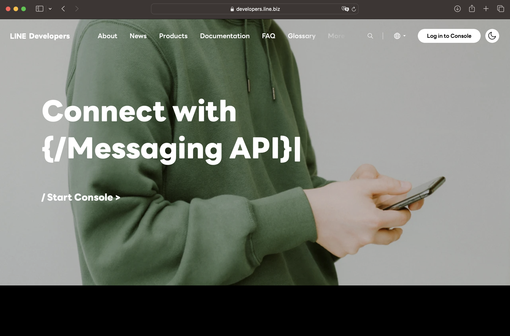

# SGGear2024 Development Class

## Table of Contents

1. [Document Control](#document-control)
2. [Prerequisite](#prerequisite)
3. [Install Visual Studio Code](#install-visual-studio-code-vscode)
4. [Install Python](#install-python)
    1) [MacOS](#macos)
    2) [Windows](#windows)
5. [Install NGROK](#install-ngrok)
6. [Line Developer](#line-developer)

## Document Control
| Version | Author             | Date         | Reason         |
|---------|--------------------|--------------|----------------|
| 1       | Shalong Samretngan | Aug 10, 2024 |Initial document|

## Prerequisite
สิ่งที่จะต้องเตรียมก่อนเริ่มเรียน Class นี้
1. Visual Studio Code (VSCode)
2. Python 3.12.5
3. Line Developer Account (https://developers.line.biz/)
4. ngrok

## Install Visual Studio Code (VSCode)
จะทำการติดตั้ง VSCode ที่เครื่องของตัวเองเพื่อเขียน code
1. เข้าไปที่ Website: https://code.visualstudio.com/download
2. เลือกตามระบบปฏิบัติการของตัวเอง (Windows หรือ ​Mac)


3. หลังจากที่ดาวน์โหลดเสร็จแล้ว ทำการติดตั้งโปรแกรม
4. Download Scource Code ที่จะใช้ใน Class นี้จาก https://gitlab.com/suprman.s/sggear2024 โดยเลือกเป็นไฟล์ `zip`


5. ทำการ Extract File `zip` และเอาโฟล์เดอร์ไปวางไว้ที่เราต้องการ
6. ที่ `VSCode` เลือก `File` > `Open Folder...` และเลือกโฟล์เดอร์ที่เราทำการ Extract ในข้อก่อนหน้า
7. ไปที่เมนู Extension ที่อยู่ซ้ายมือ


8. ค้นหาคำว่า `Jupyter` ของ Microsoft
9. ทำการกด `Install` ถ้าหากติดตั้งเสร็จจะแสดงกังรูป


10. กลับไปที่ Explorer โดยคลิกรูปคล้ายเอกสารด้านซ้ายมือบนสุด


## Install Python
จะแบ่งออกเป็น 2 ระบบปฏิบัติการ คือ MacOS และ Windows ดังนี้

### MacOS
1. เปิดโปรแกรม VSCode และโฟล์เดอร์ project ที่จะทำ
2. แถบเมนูด้านบน เลือก `Terminal` > `New Terminal` จะแสดง Terminal ด้านล่างของหน้าต่าง VSCode
3. ให้พิมพ์คำสั่ง `brew --version` ถ้าหากได้ผลลัพธ์ `Homebrew 4.3.13` (หรือ version อื่น ๆ ) ให้ข้ามไปยังข้อที่ 7
4. กรณีที่ขึ้น `zsh: command not found: brew` จะทำการติดตั้ง HomeBrew สำหรับจัดการ Package MacOS โดยจะรันคำสั่ง
```
/bin/bash -c "$(curl -fsSL https://raw.githubusercontent.com/Homebrew/install/HEAD/install.sh)"
```
ใส่รหัสเครื่อง MacBook ของตัวเอง (ตัว Terminal จะไม่แสดงสัญลักษณ์ ***** ขณะใส่รหัส ให้พิมพ์ต่อกันได้เลยแล้วกด Enter)

5. กด Enter เพื่อรัน Script ดังรูป


6. ให้พิมพ์คำสั่ง `brew --version` ควรที่จะได้ผลลัพธ์ `Homebrew 4.3.13` 
7. ทำการติดตั้ง Python 3.12.5 โดยรันคำสั่ง
```
brew install python@3.12
```
8. ตรวจสอบ version ที่ทำการติดตั้ง โดยรันคำสั่ง
```
python --version
```
หรือรัน `python3 --version` ผลลัพธ์ที่ได้ควรที่จะเป็น `Python 3.12.5`


9. ทำการติดตั้ง `pip` โดยรันคำสั่ง 
```
curl -s https://bootstrap.pypa.io/get-pip.py | python3
```

10. ตรวจสอบ pip version ที่ทำการติดตั้ง (Python  package-management system) โดยรันคำสั่ง
```
pip --version
```
หรือรัน `pip3 --version` ผลลัพธ์ที่ได้ควรที่จะเป็น `pip 24.2 from /usr/local/lib/python3.12/site-packages/pip (python 3.12)`


### Windows
1. ไปที่ Website: https://www.python.org/downloads/windows/
2. เลือกแบบ `Stable Release` (แนะนำ Version `Python 3.11` ขึ้นไป ซึ่งในตัวอย่างภาพด้านล่าง สามารถเลือก Version ล่าสุดได้ `Python 3.12.5`) และกดดาวน์โหลด `Windows installer (64 bit)`


3. ทำเครื่องหมายถูกหน้า 2 ตัวเลือกด้านล่าง และกด `Install Now`


4. รอสักครู่ให้โปรแกรม install หลังจากที่ install เรียบร้อยจะขึ้นดังรูป ให้กด `Disable path length limit` และกด `Close`


5. เปิดโปรแกรม VSCode และโฟล์เดอร์ project ที่จะทำ
6. แถบเมนูด้านบน เลือก `Terminal` > `New Terminal` จะแสดง Terminal ด้านล่างของหน้าต่าง VSCode
7. พิมพ์คำสั่งเพื่อตรวจสอบ Python version ที่ได้ทำการติดตั้ง
```
python --version
```
ผลลัพธ์ที่ได้ควรที่จะเป็น
```
PS C:\SGGear2024> python --version
Python 3.12.5
```

8. พิมพ์คำสั่งเพื่อตรวจสอบ pip version ที่ได้ทำการติดตั้ง (Python  package-management system)
```
pip --version
```
ผลลัพธ์ที่ได้ควรที่จะคล้าย ๆ กับ
```
PS C:\SGGear2024> pip --version
pip 24.2 from C:\Users\Administrator\AppData\Local\Programs\Python\Python312\Lib\site-packages\pip (python 3.12)

```


## Install ngrok
Line Server จะต้องติดต่อกับทางโปรแกรมที่เราเขียนไว้ได้ ผ่าน Internet ดังนั้นจะใช้เครื่องมือ `ngrok` เพื่อที่จะ forward development network ให้สามารถเข้าใช้งานได้จาก Internet ภายนอก

1. เข้าไปที่ Website: https://ngrok.com และทำการ `Sign up`


2. เมื่อทำการสมัครสมาชิกเรียบร้อย จะแสดงหน้า Getting Started ขึ้นมา ให้เลือกระบบปฏิบัติการของ computer และจะแสดงขั้นตอนการใช้งานมาให้


3. เปิดโปรแกรม VSCode
4. ในแถบ Terminal ด่านล่างใหคัดลอกคำสั่งในหน้า `Dashbord` ของ `ngrok` (สำหรับ Windows ให้คลิกขวาเพื่อวาง, สำหรับ Mac ให้กด `command + V`)

**MacOS**
จะทำการ install ผ่าน `brew` (จากการใช้งานติดตั้ง Python ก่อนหน้านี้)
```
brew install ngrok/ngrok/ngrok
ngrok config add-authtoken <your own api key>
```

**Windows**
เลือก Tab Download และดาวน์โหลดโปรแกรมมาติดตั้ง

```
ngrok config add-authtoken <your own api key>
```

5. กด Enter เพื่อ Run คำสั่ง
6. ทดสอบโดยการรันคำสั่ง `ngrok`


## Line Developer
ทำการสร้าง Account Line Developers เพื่อทำการสร้างหลังบ้านของ Line Official Account

1. เข้าไปยัง Website: https://developers.line.biz/


2. กด `Log in to Console` บริเวณมุมบนขวามือ
3. เลือก Log in แบบ `Log in with LINE account`
4. หลังจากที่ Log in เรียบร้อยจะแสดงหน้า `Providers` ให้ทำการกดเลือก `Create`
5. ในการ Create Provider จะเหมือนการสร้างกลุ่มของ Project หรือกลุ่มขององค์กร ซึ่งใน Provider จะสามารถกำหนดสิทธิ์การใช้งานของผู้พัฒนาได้ เช่น Project A: Messaging API ให้ LINE account G และ H สามารถจัดการได้
6. ตั้งชื่อ Provider เป็นชื่อกลุ่มของตัวเอง เช่น `dev-101`


7. คลิกที่แถบ `Roles` และเลือก `Invite by email`
8. ให้ใส่อีเมล Account LINE ของสมาชิกในกลุ่มเข้าไป และเลือกเป็น Role: `Admin` เพื่อให้สมาชิกสามารถเขามาจัดการ Line Dev ได้


9. กลับมาที่แถบ `Channels` เลือก `Create a Messaging API channel`


10. จะแสดงแบบฟอร์มให้กรอก และจะต้องกรอกรายละเอียดดังนี้
- **Company or owner's country or region**: เลือกเป็น `Thailand`
- **Channel icon**: สามารถใส่รูปก็ได้ หรือจะเว้นไว้ก็ได้
- **Channel name**: ให้ใส่ชื่อ Line Official Account (Line OA) เช่น `dev-101-bot`
- **Channel description**: ใส่คำอธิบาย อะไรก็ได้
- **Category**: เลือกหมวดหมู่ เช่น `การศึกษา`
- **Subcategory**: เลือกหมวดหมู่ย่อยจาก Category ก่อนหน้า เช่น `มัธยมศึกษา`
- **Email address**: จะเป็นอีเมลของคนที่กดสร้าง Account นี้
- เลือก **checkbox** ทั้งหมด

11. หลังจากกรอกข้อมูลเสร็จสิ้น กด `Create` > กด `OK` > กด `Agree`


12. ในส่วน `Basic settings` และ `Basic information` จะมีลิงก์ที่เชื่อมต่อไปยัง LINE Official Account ให้กดที่ `LINE Official Account Manager`


13. จะแสดง Line OA Manager ตามรูปด้านล่าง สามารถนำไปใช้งานกับ User โดยการ Add Line OA และแชทคุยได้


14. เมนูด้านข้างซ้าย ในส่วนของ `Setting` ไปที่แถบเมนู `Response settings` ทำการปิด `Greeting message` และ ปิด `Auto-response messages` (เราจะใช้การแชทผ่าน Webhooks แต่จะไปเปิดในหน้า Developer)


15. กลับมาที่หน้า Developer
16. ในแถบเมนู Basic settings เลื่อนลงมาบริเวณด้านล่าง จะเจอ `Channel secret` ให้ทำการคัดลอกส่วนนี้ไว้ (สามารถกดปุ่ม `Issue` เพื่อขอรหัสที่ generate ใหม่ได้)


17. เลือกแถบเมนู `Messaging API` (เมนูบริเวณด้านบนข้างกับ Basic settings)
18. เลื่อนลงมาล่างสุดในแถบ `Channel access token` ให้กด `Issue` ซึ่งจะได้ Access Token มาเพื่อใช้ในการทำ Bot ให้ทำการคัดลอกส่วนนี้ไว้ (สามารถกดปุ่ม `Reissue` เพื่อขอรหัสที่ generate ใหม่ได้)


19. แถบเมนู `Messaging API` จะมี QR Code สำหรับเพิ่มเพื่อน ให้ทำการสแกนเพิ่มเพื่อนไว้ (หรือสามารถใช้ Bot basic ID ไลน์แอด ค้นหาได้เช่นกัน)


20. ในส่วนของ Part Line Dev หน้านี้จะทำการ Configure ในส่วนของ Webhook URL เพิ่มเติม หลังจากที่ทำการสร้าง Bot โดยใช้ภาษา Python เรียบร้อยแล้ว


## What is LINE Messaging API


[Messaging API overview](https://developers.line.biz/en/docs/messaging-api/overview/#page-title) - Requests are sent over **HTTPS** in **JSON**. The communication flow between a bot server and the LINE Platform is as follows:

1. A user sends a message to a LINE Official Account.
2. The LINE Platform sends a webhook event to the webhook URL of the bot server.
3. The bot server checks the webhook event and responds to the user through the LINE Platform. *(with your coding/logic)*

\
**What's LINE Messaging API can do?**
1. Send reply messages
2. Send messages at any time
3. **Send different message types**
    1. Text message
    2. Sticker message
    3. Image message
    4. Video message
    5. Audio message
    6. Location message
    7. Imagemap message
    8. Template message
    9. Flex Message
4. Get content sent by users
5. Get user profiles
6. Join group chats
7. Use rich menus
8. Use beacons
9. Use account link
10. Get the number of sent messages


## Create Virtual Environment
Run following command in your working directory
```
virtualenv venv
```
where, `venv` is your virtual environment name

## Activate Virtual Environment
Run following command in your working directory
```
source venv/bin/activate
```

## Install Python Package
There's 3 required packages:
1. line-bot-sdk
2. fastapi
3. uvicorn
4. python-dotenv

To install latest version, run `pip` command to install 
```
pip install line-bot-sdk fastapi uvicorn python-dotenv
```
Or, you can install with the `requirements.txt`
```
pip install -r requirements.txt
```

## Environment Configuration
Create file `.env` and put your token inside.

```
ACCESS_TOKEN=<Your dhannel access token>
CHANNEL_SECRET=<Your Channel secret>
```

## Running FastAPI
Using following command to run FastAPI on port 8000:
```
uvicorn main:app --port 8000 --reload
```
The `reload` flag is for reload everytime that file made change.